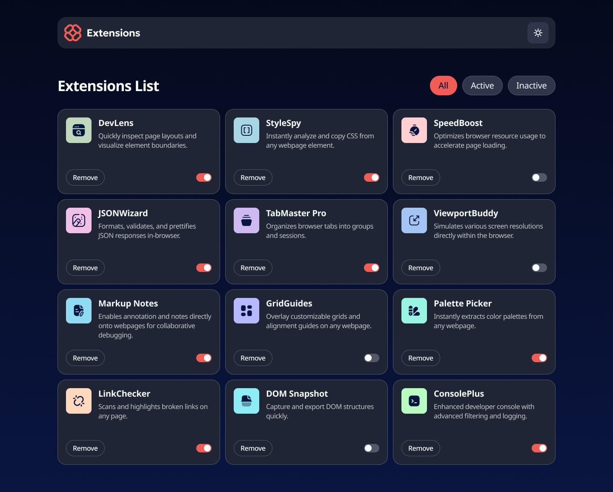
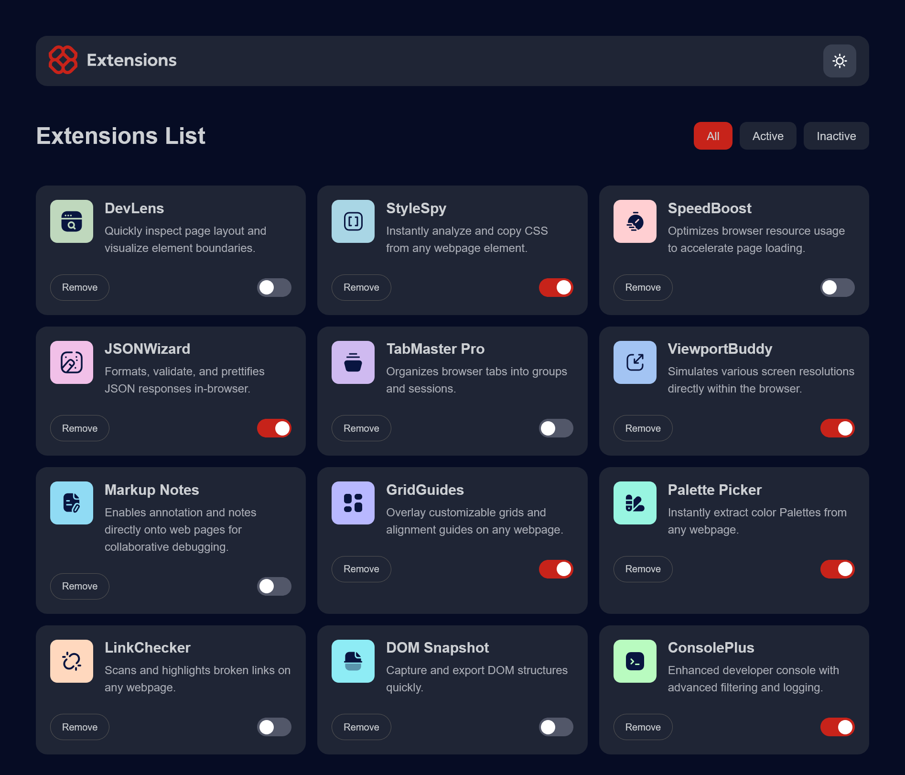
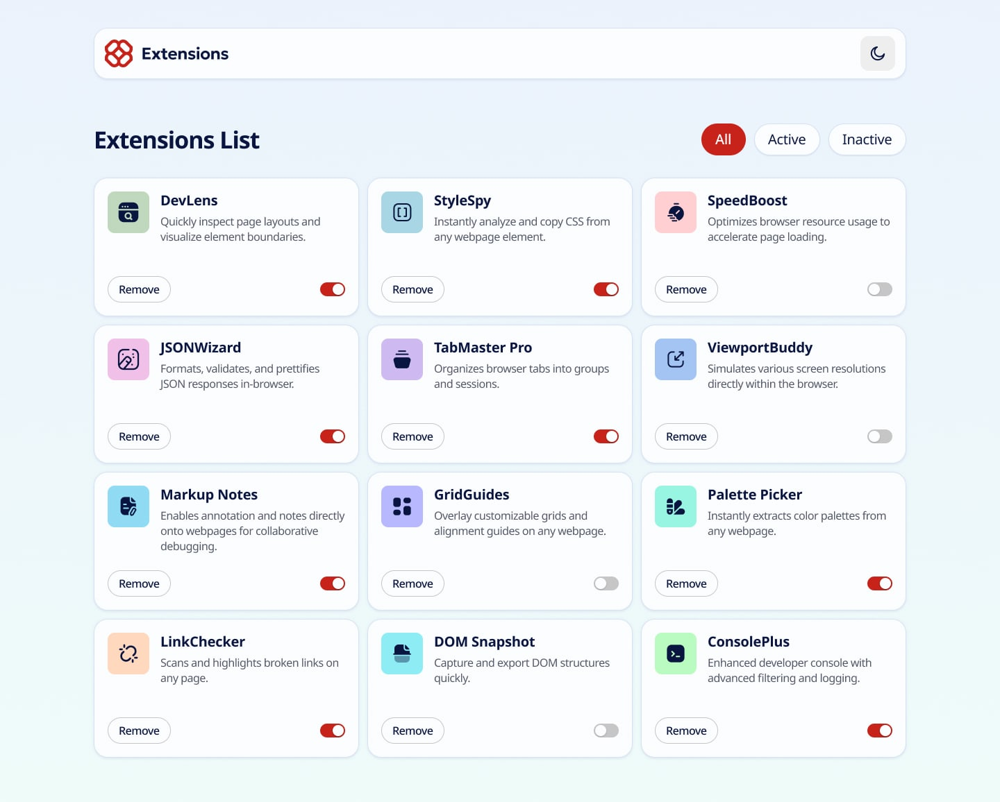

# Browser Extension Manager

A responsive Browser Extension Manager that allows users to organize, filter, and manage browser extensions through an intuitive interface. Users can enable or disable extensions, filter them by status, remove extensions from the list, and switch between light and dark themes with persistent preferences.

---

## Live Demo

**Live Site:** *(https://xinfinitygen.github.io/Browser-extension-manager-UI/)*

---

## 📸 Preview

*Original Design UI in Dark Mode My Design UI in Dark Mode  Light Mode*

---

## Features

- Responsive design for desktop, tablet, and mobile devices
- Light and Dark mode theme switching
- Theme preference saved using Local Storage
- Enable and disable extensions
- Filter extensions by:
  - All
  - Active
  - Inactive
- Remove extensions from the interface
- Extension status persists after page refresh
- Smooth UI transitions
- Semantic HTML structure
- Accessible markup using alt attributes and ARIA labels

---

## 🛠️ Built With

- HTML5
- CSS3
- JavaScript (ES6)
- Local Storage API

---

## 📂 Project Structure

```
Browser-Extension-Manager/
│
├── Assets/
│   ├── images/
│
├── styles/
│   └── styles.css
│
├── script.js
├── index.html
└── README.md
```

---

## What I Learned

While building this project, I gained practical experience with:

- DOM Manipulation
- Event Listeners
- Query Selectors
- NodeLists
- Data Attributes (`data-*`)
- Local Storage
- Theme Switching
- Conditional Rendering
- Array Iteration using `forEach()`
- Responsive Layouts with CSS Grid
- Building reusable UI components

---

## 💡 Challenges

Some interesting challenges I solved included:

- Persisting the user's selected theme using Local Storage.
- Saving each extension's active/inactive state after refreshing the page.
- Building dynamic filtering without reloading the page.
- Recreating the design as accurately as possible.
- Implementing a custom toggle switch entirely with HTML and CSS.

---

## 🔮 Version 2 (Planned Improvements)

The current version closely follows the original design challenge.

For Version 2, I plan to extend the application with additional features such as:

- Restore removed extensions instead of permanently deleting them
- Dedicated "Removed Extensions" section
- Search extensions by name
- Add new custom extensions
- Edit extension information
- Sort extensions alphabetically
- Improved accessibility
- More animations and micro-interactions

---

## Inspiration

This project was built as part of a Frontend coding challenge and later enhanced with additional functionality beyond the original requirements to improve the overall user experience.

---

## Author

**Okechukwu Ezekiel**

GitHub:
https://github.com/Xinfinitygen

---

If you found this project helpful, consider giving it a ⭐.